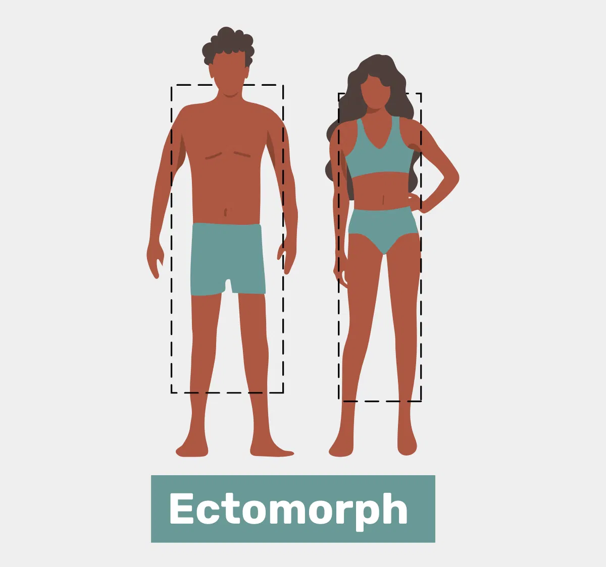
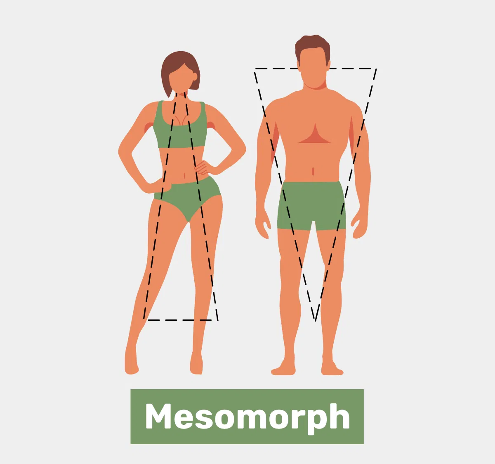
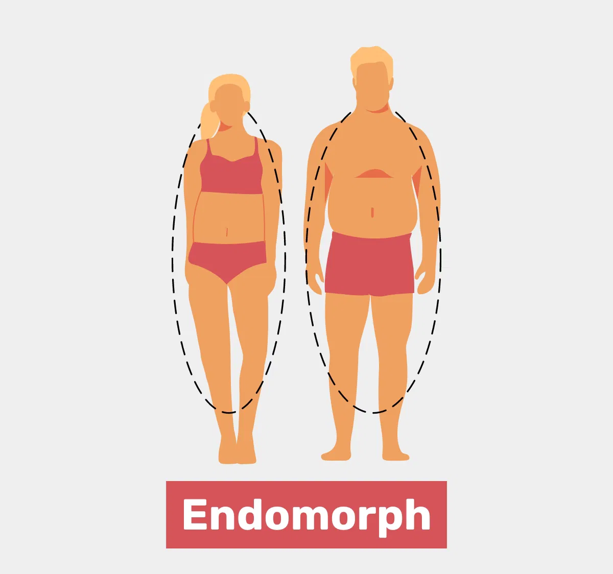
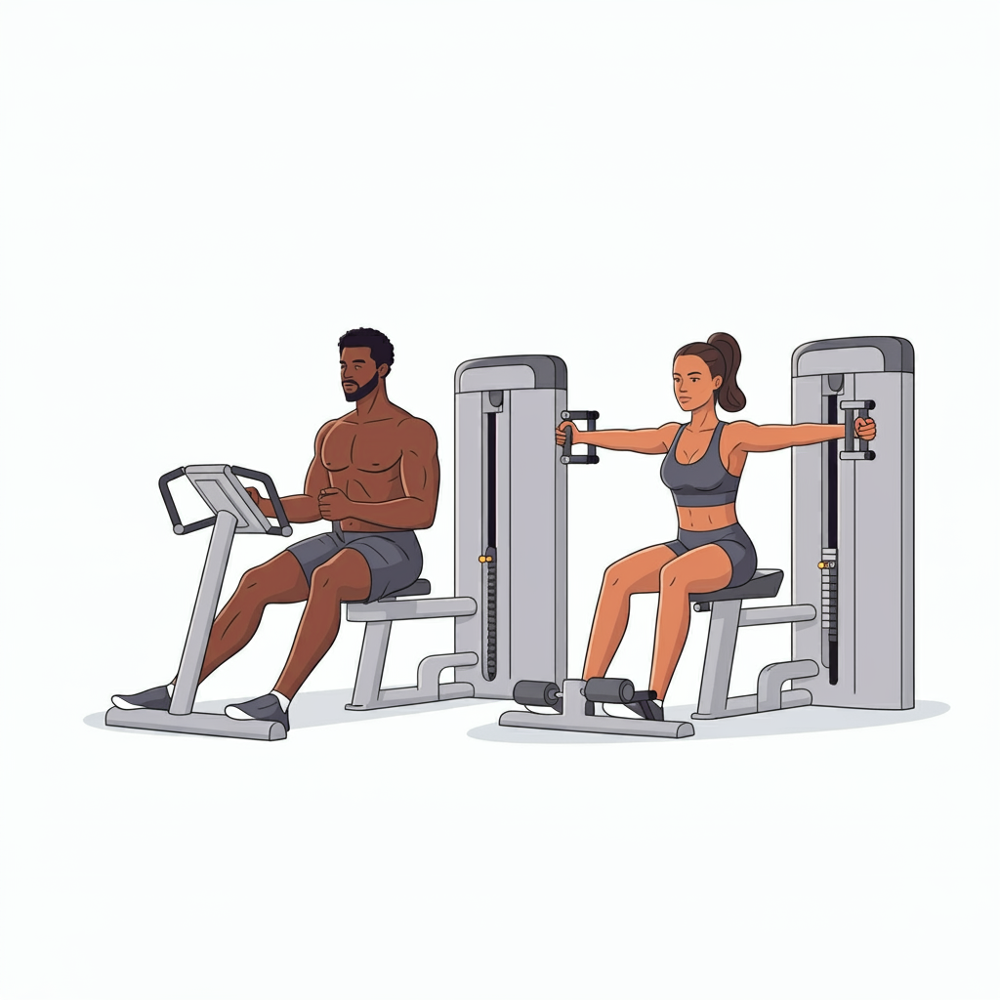
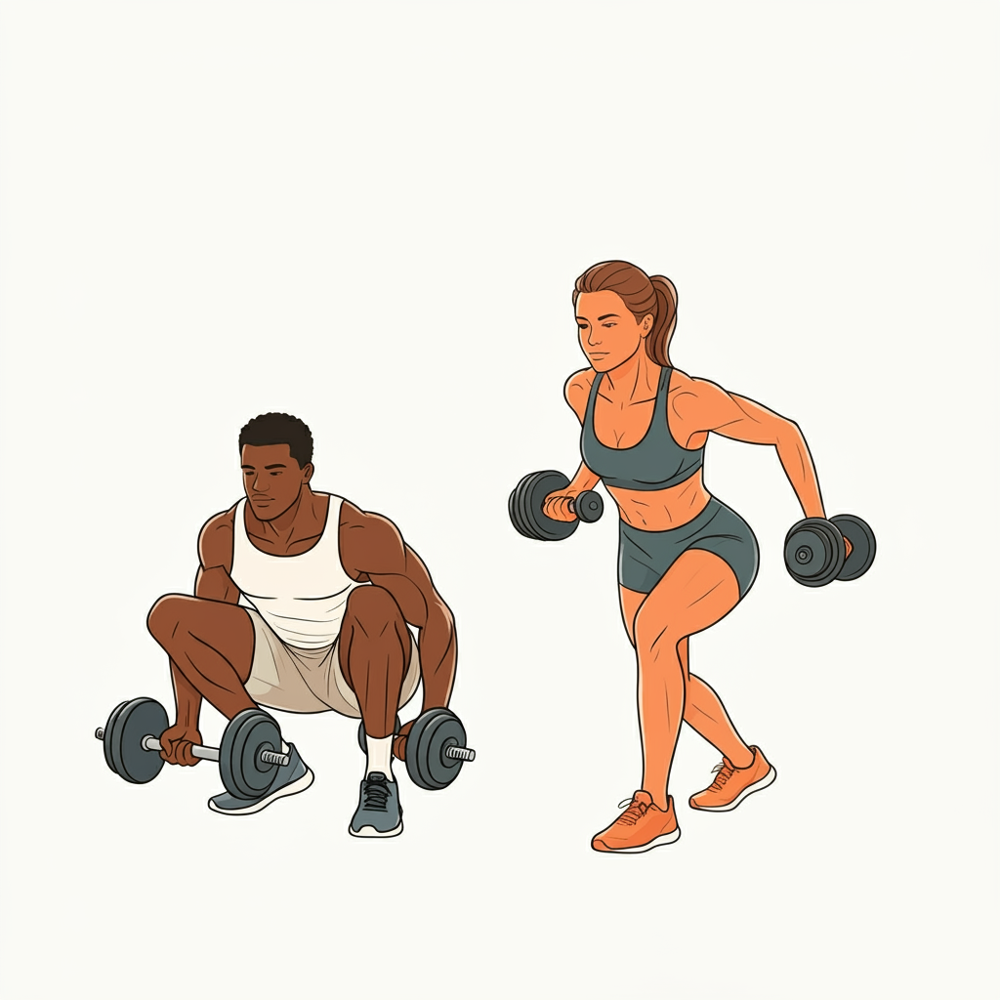

       

  
  
  

  <h3>🏋️‍♂️ Assistente de Personal Trainer - Gerador de Treino Ideal</h3>
  
Este projeto visa criar um assistente virtual que gera treinos personalizados, baseados em informações como biotipo corporal, disponibilidade de dias para treino e preferências de exercícios. Ele ajuda o usuário a criar um plano de treino ideal de forma simples e prática, utilizando boas práticas de engenharia de prompt.

## 📋 Índice

- [📝 Introdução](#-introdução)
- [💪 Biotipos Corporais](#-biotipos-corporais)
- [📅 Dias Disponíveis para Treino](#-dias-disponíveis-para-treino)
- [🏋️ Tipos de Exercícios](#️-tipos-de-exercícios)
- [🛠️ Regras de Negócio](#️-regras-de-negócio)
- [🎯 Prompt de Resposta Proposto](#-prompt-de-resposta-proposto)
- [📖 Material de Apoio](#-material-de-apoio)

---

## 📝 Introdução

O objetivo deste projeto é criar um assistente de personal trainer automatizado, que gera treinos personalizados de acordo com o biotipo corporal, a disponibilidade de tempo para treinar e o tipo de exercício preferido. Com isso, o usuário pode obter um plano de treino otimizado e eficiente.

A personalização do treino é feita por meio de três critérios principais: biotipo, dias disponíveis e preferências de exercício. O assistente utiliza essas informações para sugerir o treino ideal para cada usuário.

---

## 💪 Biotipos Corporais

O primeiro passo na personalização do treino é identificar o biotipo corporal do usuário. O biotipo corporal influencia diretamente o tipo de treino, já que diferentes tipos de corpos respondem de maneiras variadas a diferentes estímulos.

Os três biotipos principais são:
=======
### Os três biotipos principais são:

<table>
  <tr>
    <th>Imagem</th>
    <th>Biotipo</th>
    <th>Descrição</th>
  </tr>
  <tr>
    <td style="text-align: center;">
      
    </td>
    <td><strong>Ectomorfo</strong></td>
    <td>Corpo mais magro, difícil ganhar peso e massa muscular.</td>
  </tr>
  <tr>
    <td style="text-align: center;">
      
    </td>
    <td><strong>Mesomorfo</strong></td>
    <td>Corpo naturalmente musculoso, facilidade para ganhar massa muscular e perder gordura.</td>
  </tr>
  <tr>
    <td style="text-align: center;">
      
    </td>
    <td><strong>Endomorfo</strong></td>
    <td>Corpo com tendência a acumular gordura, maior dificuldade em perder peso.</td>
  </tr>
</table>

> **Nota:** Escolha o biotipo que mais se aproxima do seu corpo atual para que o treino seja mais eficiente.

---

## 📅 Dias Disponíveis para Treino

Com base na quantidade de dias que o usuário pode treinar, o plano de treino será ajustado. Quanto mais dias disponíveis, mais específico e intenso será o treino.

| **Imagem**                                                     | **Dias por Semana** | **Tipo de Treino Sugerido**   |
| -------------------------------------------------------------- | ------------------- | ----------------------------- |
|  | 1 dia               | Treino Full Body              |
|  | 3 dias              | Treino ABC                    |
|  | 5 dias              | Treino ABCDE                  |

- **Full Body**: Treino completo que trabalha o corpo todo em uma única sessão, ideal para quem treina 1 vez por semana.
- **ABC**: Divisão do treino em 3 dias, focando em diferentes grupos musculares (ex: A para peito, B para costas, C para pernas).
- **ABCDE**: Divisão do treino em 5 dias, com foco mais específico e intenso para cada grupo muscular.

### Exemplo de Rotinas para 3 e 5 dias por semana:

- **Treino ABC (3 Dias)**:  
  - **Dia A**: Peito, ombro, tríceps  
  - **Dia B**: Costas, bíceps, abdômen  
  - **Dia C**: Pernas, glúteos, panturrilhas

- **Treino ABCDE (5 Dias)**:  
  - **Dia A**: Peito  
  - **Dia B**: Costas  
  - **Dia C**: Pernas  
  - **Dia D**: Ombro  
  - **Dia E**: Braços (bíceps, tríceps) e abdômen

---

## 🏋️ Tipos de Exercícios

A terceira regra envolve a escolha do tipo de exercício preferido. Aqui estão algumas categorias com exemplos:

| **Imagem**                                                         | **Tipo de Treino** | **Descrição**                                                                                                 |
| ------------------------------------------------------------------ | ------------------ | ------------------------------------------------------------------------------------------------------------- |
|   | **Funcional**      | Exercícios que melhoram a funcionalidade do corpo, usando movimentos naturais.                                |
|  | **Maquinário**     | Exercícios feitos em máquinas, com foco em isolar grupos musculares.                                          |
|  | **Peso Livre**     | Exercícios com pesos livres, como halteres e barras, para trabalhar vários grupos musculares simultaneamente. |
|      | **Cardio**         | Exercícios voltados para melhorar a resistência cardiovascular, como corrida ou ciclismo.                     |
|        | **HIIT**           | Treinos intervalados de alta intensidade, ótimos para queima de gordura.                                      |

### Exemplos de Exercícios:

- **Funcional**: Agachamento, flexões, abdominais, saltos no banco, burpees.
- **Maquinário**: Leg press, extensora, peck deck, aparelho para bíceps.
- **Peso Livre**: Agachamento com barra, levantamento terra, supino com barra, rosca direta.
- **Cardio**: Corrida na esteira, bicicleta ergométrica, natação, corda.
- **HIIT**: Sprints curtos, pular corda rápido, saltos pliométricos.

---

## 🛠️ Regras de Negócio

Para que o plano de treino seja ideal, as escolhas feitas pelo usuário precisam ser seguidas de forma sequencial e lógica. Aqui estão as etapas do processo:

1. **Identificação do biotipo corporal**: A escolha do biotipo vai definir a intensidade e o foco do treino (massa muscular, emagrecimento, manutenção).
2. **Definição dos dias disponíveis para treino**: Dependendo do número de dias, o treino será ajustado para maximizar o aproveitamento do tempo disponível.
3. **Seleção do tipo de exercício**: A escolha dos exercícios vai permitir um treino mais eficiente, alinhado com as preferências do usuário.

4. **Geração do plano de treino**: Com as escolhas feitas, o assistente irá gerar um plano detalhado com os exercícios, a carga e o número de repetições adequados.

---

## 🎯 Prompt de Resposta Proposto

Com as informações coletadas, o assistente de treino gerará o plano da seguinte forma:

### Perguntas do Assistente:

1. **Qual é o seu biotipo corporal?** (Ectomorfo, Mesomorfo, Endomorfo)
2. **Quantos dias por semana você pode treinar?** (1, 3, 5)
3. **Qual tipo de exercício você prefere?** (Funcional, Maquinário, Peso Livre, Cardio, HIIT)

### Exemplo de resposta:

- **Biotipo:** Mesomorfo
- **Dias de treino:** 5
- **Tipo de exercício preferido:** Maquinário

Com essas informações, o assistente irá sugerir um treino detalhado com exercícios adequados ao biotipo e aos objetivos do usuário, dentro da disponibilidade de dias escolhida.

---

## 📖 Material de Apoio

Para aprender mais sobre como construir prompts eficazes e melhorar suas práticas de engenharia de prompt, confira os seguintes materiais:

- [Fundamentos de Engenharia de Prompt](https://elidianaandrade.gitbook.io/fundamentos-de-engenharia-de-prompts-com-claude-3)
- [Boas Práticas de Prompt](https://aline-antunes.gitbook.io/otimize-seus-prompts-e-aprenda-mais-usando-ias-1)

